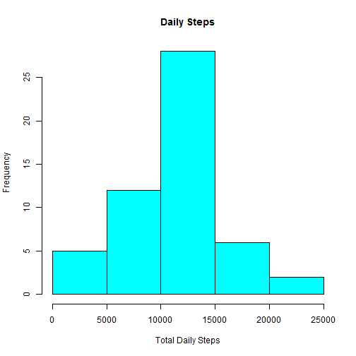
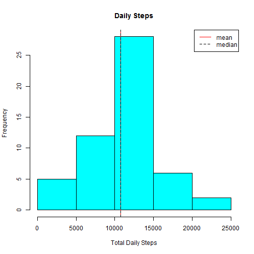
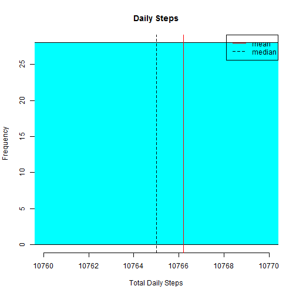

# Reproducible Research: Peer Assesment 1


## Loading and preprocessing the data


```r
library(data.table)
library(lubridate)
unzip("activity.zip")
data <- fread("activity.csv", stringsAsFactors = FALSE)
data$time <- substr(as.POSIXlt(sprintf("%04.0f", data$interval), 
                               format='%H%M'), 12, 16)
data$date <- ymd(data$date)
data$datetime <- ymd_hm(paste(data$date, data$time))
```


## What is mean total number of steps taken per day?

First arrange the data into groups by date and find the sum of each groups steps taken


```r
library(dplyr)
sdata <- data %>%
        group_by(date) %>%
        summarise(Totalsteps = sum(steps))
```

Produce histogram of total steps    
     

```r
hist(sdata$Totalsteps, main = "Daily Steps",
     xlab = "Total Daily Steps", col = "cyan")
```

 

Find mean and median


```r
summary <- function(x) {
        funs <- c(mean, median)
        lapply(funs, function(f) f(x, na.rm = TRUE))
}

meandat <- as.data.table(summary(sdata$Totalsteps))
setnames(meandat, 1:2, c("mean", "median"))
```

The mean is 1.0766189 &times; 10<sup>4</sup> and the median is 10765.  
We can show that on the histogram by


```r
hist(sdata$Totalsteps, main = "Daily Steps",
     xlab = "Total Daily Steps", col = "cyan")
abline(v=mean(sdata$Totalsteps, na.rm=TRUE), col ="red")
abline(v=median(sdata$Totalsteps, na.rm=TRUE), col = "black", lty = 2)
legend("topright", legend = c("mean",
                              "median"), 
       lty = c(1,2), col = c("red", "black"))
```

 

But its hard to see the difference in the mean and median lines.  
So we can zoom in for a closer look with


```r
hist(sdata$Totalsteps, main = "Daily Steps",
        xlab = "Total Daily Steps", col = "cyan", xlim = c(10760, 10770))
abline(v=mean(sdata$Totalsteps, na.rm=TRUE), col ="red")
abline(v=median(sdata$Totalsteps, na.rm=TRUE), col = "black", lty = 2)
legend("topright", legend = c("mean", "median"), 
               lty = c(1,2), col = c("red", "black"))
```

 

Now we can see the difference between mean and median.

## What is the average daily activity pattern?


## Imputing missing values


## Are there differences in activity patterns between weekdays and weekends?
