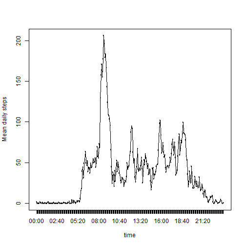

# Reproducible Research: Peer Assesment 1

This assesement assumes that the data file ("activity.zip") has already been downlaoded and is stored in the working directory before running knit2HTML to produce the assesment files.

## Loading and preprocessing the data

The following code unzips the data file then reads in the data to a datatable 
It then creates a 'time' column by extracting the given 'intervals' and converting them to 24 hour format.
Converting the date to class(POSIXct) also allows us to join together the date and time into one column 'datetime'


```r
library(data.table)
library(lubridate)
unzip("activity.zip")
data <- fread("activity.csv", stringsAsFactors = FALSE)
data$time <- substr(as.POSIXlt(sprintf("%04.0f", data$interval), 
                               format='%H%M'), 12, 16)
data$date <- ymd(data$date)
data$datetime <- ymd_hm(paste(data$date, data$time))
```


## What is mean total number of steps taken per day?

First arrange the data into groups by date and find the sum of each groups steps taken


```r
library(dplyr)
sdata <- data %>%
        group_by(date) %>%
        summarise(Totalsteps = sum(steps))
```

Produce histogram of total steps    
     

```r
hist(sdata$Totalsteps, main = "Daily Steps",
     xlab = "Total Daily Steps", col = "cyan")
```

 

Find mean and median


```r
summary <- function(x) {
        funs <- c(mean, median)
        lapply(funs, function(f) f(x, na.rm = TRUE))
}
meandat <- as.data.table(summary(sdata$Totalsteps))
setnames(meandat, 1:2, c("mean", "median"))
```

The mean is `meandat$mean` 10766.19 and the median is `meandat$median` 10765.  
We can show that on the histogram by


```r
hist(sdata$Totalsteps, main = "Daily Steps",
     xlab = "Total Daily Steps", col = "cyan")
abline(v=mean(sdata$Totalsteps, na.rm=TRUE), col ="red")
abline(v=median(sdata$Totalsteps, na.rm=TRUE), col = "black", lty = 2)
legend("topright", legend = c("mean",
                              "median"), 
       lty = c(1,2), col = c("red", "black"))
```

 

But its hard to see if there is a difference between the mean and median lines.  
So we can zoom in for a closer look with


```r
hist(sdata$Totalsteps, main = "Daily Steps",
        xlab = "Total Daily Steps", col = "cyan", xlim = c(10760, 10770))
abline(v=mean(sdata$Totalsteps, na.rm=TRUE), col ="red")
abline(v=median(sdata$Totalsteps, na.rm=TRUE), col = "black", lty = 2)
legend("topright", legend = c("mean", "median"), 
               lty = c(1,2), col = c("red", "black"))
```

 

Now we can see there is a difference between mean and median.

## What is the average daily activity pattern?

First group the data by time and get the mean of each group


```r
tdata <- data %>%
        group_by(time) %>%
        summarise(Meansteps = mean(steps, na.rm=TRUE)) 
```

plot the data


```r
with(tdata, {plot(Meansteps~factor(time), type="l", xlab = "time", 
                  ylab ="Mean daily steps")
             lines(Meansteps~factor(time), type = "l")})
```

 

Find the maximum 5 minute interval


```r
maxt <- subset(tdata, tdata$Meansteps == max(tdata$Meansteps))
```

And we can see maximum time interval is `max$time` 08:35 at `max(tdata$Meansteps)` 206.17 steps


## Imputing missing values

Calculate and report the total number of missing values.

```r
missing <- length(which(is.na(data)))
```
The total number of rows with NAs is `missing` 2304

My strategy to replace NAs with values is to take the mean of each 5 minute interval and use that value for the corresponding NA (i.e a NA at 08:05 will be replaced with the mean of 08:05 as worked out in the the last section and stored in the datatable 'tdata')


```r
datam <- merge(data, tdata, by="time")
datam$steps[is.na(datam$steps)] <- datam$Meansteps[is.na(datam$steps)]
```

Histogram of the Total number of steps taken each day from the new data set


```r
smdata <- datam %>%
        group_by(date) %>%
        summarise(Totalsteps = sum(steps))
hist(smdata$Totalsteps, main = "Daily Steps",
     xlab = "Total Daily Steps", col = "cyan")
```

 

```r
meandatm <- as.data.table(summary(smdata$Totalsteps))
setnames(meandatm, 1:2, c("mean", "median"))
```

The mean of the new data set is `meandatm$mean` 10766.19  
The median of the new data set is `meandatm$median` 10766.19

### Are the values the same?

Mean of part 1 equals Mean of part 3? `meandat$mean == meandatm$mean` TRUE  
Median of part 1 equals Median of part 3 `meandat$median == meandatm$median` FALSE

By replacing the missing values with the mean of all days corresponding to that particular 5 minute interval, it has not changed the mean value of the original data but has shifted the median value which is now equal to the mean as well.

New mean value equals new median value? `meandatm$mean == meandat$median` TRUE


## Are there differences in activity patterns between weekdays and weekends?

Sort new data by weekdays or weekends, add to datatable as Factor of two levels


```r
datam = within(datam, {
        DOWGroup = as.factor( 
                ifelse((weekdays(datam$date, abbreviate=TRUE) 
                         %in% c("Sat","Sun")) 
                        , "weekend", "weekday"))})
```

Prepare the data and find the means of the steps in each group "weekday" or "weekend"


```r
TWdata <- as.data.table(
        aggregate(steps ~ DOWGroup + time 
                  , data=datam
                  , FUN="mean")
)
setnames(TWdata, c(3), "AvgSteps")
```

Using the (lattice) library create timeline panel plot of the two Factor groups


```r
library(lattice)
xyplot(
        AvgSteps ~ factor(time) | DOWGroup
        , data=TWdata
        , layout=c(1,2)
        , main="Time Series: Avg Steps vs 5-Minute interval ID, Split by DOW Group"
        , xlab="5-Minute interval"
        , ylab="Average Steps Taken"
        , type=c("l","l")
)
```

 

